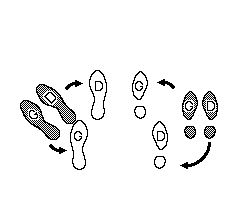
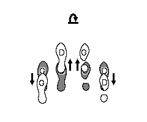
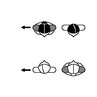
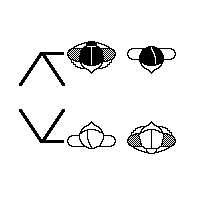

Avant-deux de Bazouges
======================

Если взять музыку из видео с танцем на фестивале, то она идёт на 4 счёта, которые идут парами. То есть каждые 8 счетов можно легко различить на слух. В музыке акцентом выделен 1й счет. Танец строится из элементов, каждый из которых выполняется за 4 счета. Но всегда два элемента удобнее считать одним элементом на 8 счетов - это позволит не выпадать из ритма.

В танце используется специальный шаг, который напоминает прихрамывание, его можно выучить, используя обучающее видео. Буду называть его базужным шагом далее. Замечу:
- в этом шаге есть опорная нога и не опорная. Опорная нога не меняется в течении всего танца.
- у кавалеров опорная нога - правая, а у дам - левая.
- можно заметить, что танцор почти никогда не наступает на пятку не опорной ноги.
- в базужном шаге спиной вперед НЕ опорная нога идёт первой, а опорная её догоняет.

Танец танцуется от двух пар и больше. Дама справа от кавалера, пары стоят по кругу, глядя в центр круга. Если пар две, то пары стоят друг напротив друга (на диаметре невидимого круга). Если пар три, то пары стоят на вершинах равностороннего треугольника, смотря в центр этого треугольника (треугольник можно вписать в круг). И т.д. Круг должен быть достаточно свободным, чтобы кавалер или дама могли сместиться от своего партнера вдоль круга. Некоторые замечания про случай только двух пар даны в конце описания.

Схемы с _картинками_, переведённые гуглопереводчиком:
===================================================
- [Общая схема](https://translate.google.ru/translate?sl=fr&tl=ru&js=y&prev=_t&hl=en&ie=UTF-8&u=http%3A%2F%2Fdansesbretonnes.gwalarn.org%2Fdanses%2Favant-deux_de_bazouges.html). [Оригинал на французском](http://dansesbretonnes.gwalarn.org/danses/avant-deux_de_bazouges.html).
- [Основной шаг (в одиночном повороте есть отличие от этой версии)](https://translate.google.ru/translate?hl=en&sl=fr&tl=ru&u=http%3A%2F%2Fdansesbretonnes.gwalarn.org%2Fdanses%2Favant-deux_de_bazouges_pas_av2.html). [Оригинал на французском](http://dansesbretonnes.gwalarn.org/danses/avant-deux_de_bazouges_pas_av2.html).
- [Поворот в паре](https://translate.google.ru/translate?hl=en&sl=fr&tl=ru&u=http%3A%2F%2Fdansesbretonnes.gwalarn.org%2Fdanses%2Favant-deux_de_bazouges_pas_av4.html). [Оригинал на французском](http://dansesbretonnes.gwalarn.org/danses/avant-deux_de_bazouges_pas_av4.html).
- [Общая схема поворота в паре](https://translate.google.ru/translate?hl=en&sl=fr&tl=ru&u=http%3A%2F%2Fdansesbretonnes.gwalarn.org%2Fdanses%2Favant-deux_de_bazouges_av4.html). [Оригинал на французском](http://dansesbretonnes.gwalarn.org/danses/avant-deux_de_bazouges_av4.html).

Часть кавалеров
===============
Дамам нужно обязательно читать мужскую часть.

### Счёт 1-8:

- *смещение\_кавалера\_влево* [1-и-2-и-3-и]
- *прыжок\_в\_левую\_диагональ* [4]
- *подпрыг* [5-и]
- *возврат* [6-и-7-и]
- *прыжок\_в\_правую\_диагональ* [8]

**[на 1-и-2-и-3-и]**: (*смещение\_кавалера\_влево*): кавалер на базужном шаге смещается от дамы влево вдоль круга, двигаясь задом (по часовой стрелке, не сильно далеко).  
**[на 4]**: (*прыжок\_в\_левую\_диагональ*): прыгнуть на опорную ногу, толкаясь другой ногой. При этом нужно немного вынести её вперед - она зависает в воздухе. Прыгнуть нужно в левую диагональ (если смотреть в центр круга). На видео с танцем молодежи на фестивале направление хорошо видно.  
**[на 5-и]**: (*подпрыг*): небольшой прыжок назад на опорной ноге (с одновременным легким задиранием второй ноги в колене).  
**[на 6-и-7-и]**: (*возврат*): задом возвратиться базужным шагом к месту до прыжка. При этом НЕ опорная нога идёт первой, а опорная её догоняет.  
**[на 8]**: (*прыжок\_в\_правую\_диагональ*): прыгнуть на опорную ногу, толкаясь другой ногой. Прыгнуть нужно в правую диагональ.

### Альтернативное описание:

Гораздо лучше, чем у меня, про прыжок, подпрыг и возврат назад показано и написано [_тут_](https://translate.google.ru/translate?hl=en&sl=fr&tl=ru&u=http%3A%2F%2Fdansesbretonnes.gwalarn.org%2Fdanses%2Favant-deux_de_bazouges_pas_av2.html) (_[оригинал на французском](http://dansesbretonnes.gwalarn.org/danses/avant-deux_de_bazouges_pas_av2.html)_):

На счёт 1-и-2-и-3-и-4-5-и-6-и-7-и-8 всё происходит. По ссылке еще больше текстовых комментариев и _картинки_. Тут между 4 и 5 нет дополнительной "и", различимой на слух, то есть интервал слышится длиннее. Этому месту как раз соответствует прыжок и пауза до подпрыга. У кавалеров опорна нога - правая.

[*смещение\_кавалера\_влево*]:  
**[на 1]**: вес тела на правой, небольшой шажок влево левой ногой.  
**[на и]**: вес тела на левой, небольшой шажок влево правой ногой.  
**[на 2]**: вес тела на правой, небольшой шажок влево левой ногой.  
**[на и]**: вес тела на левой, небольшой шажок влево правой ногой.  
**[на 3]**: вес тела на правой, небольшой шажок влево левой ногой.  
**[на и]**: вес на левой ноге, небольшой шажок правой ногой влево. Вес продолжает оставаться на левой ноге. Правая нога - рядом.

[*прыжок\_в\_левую\_диагональ*]:  
**[на 4]**: вес у нас на левой. Делаем прыжок на правую ногу в левую диагональ ромба, толокаясь левой ногой, которая после этого оказывается в воздухе. Она не должна вылететь слишком далеко вперед, чтобы не задеть танцующего впереди.

[_Далее под "назад" имеется ввиду движение обратно к месту с которого прыгнули._]

[*подпрыг*]:  
**[на 5]**: небольшой прыг назад опять же на правой ноге (вес так и остался на ней, а левая - в воздухе). Левая нога сгибается в колене.  
**[на и]**: левая нога опускается рядом с правой на фиктивную поддержку, то есть вес остаётся на правой.

[*возврат*]:  
**[на 6]**: вес продолжает оставаться на правой, небольшой шажок левой назад.  
**[на и]**: вес уже на левой ноге, небольшой шажок назад правой.  
**[на 7]**: вес уже на правой ноге, небольшой шажок назад левой.  
**[на и]**: вес уже на левой ноге, небольшой шажок правой назад. Вес продолжает оставаться на левой ноге. Правая нога - рядом.

[*прыжок\_в\_правую\_диагональ*]:  
**[на 8]**: вес у нас на левой ноге. Делаем прыжок на правую ногу в правую диагональ ромба, толокаясь левой, которая после этого оказывается в воздухе. Она не должна вылететь слишком далеко вперед, чтобы не задеть танцующего впереди.  
...  

Тут, по сути мы замкнули цикл и этот основной шаг повторяется. ***ВАЖНО***: на базужном шаге - когда движешься спиной вперед - нужно немного приседать в коленях, так чтобы шаги были покачивающиеся вверх-вниз.

### Счет 9-16:

- *подпрыг* [1-и]
- *возврат* [2-и-3-и]
- *прыжок\_в\_левую\_диагональ* [4]
- *подпрыг* [5-и]
- *возврат* [6-и-7-и]
- *топ* [8]

**[на 4]**: (*топ*): выставляем в бок опорную ногу не перенося на нее вес.

### Счет 17-24:

- *одиночный\_поворот* [1-2-и-3-и]
- *прыжок\_в\_левую\_диагональ* [4]
- *подпрыг* [5-и]
- *возврат* [6-и-7-и]
- *прыжок\_в\_правую\_диагональ* [8]

[_И дамы, и кавалеры (в свою очередь) поворачиваются по часовой стрелке._]  
**[на 1-2-и-3-и]**: (*одиночный\_поворот*): поворот вокруг своей оси. Поворот осуществляется на бузужных шагах вперед (принцип тот же, только вперед). Но при этом первый самый шаг - просто длиный прыжок в поворте на опорную ногу, толкаясь не опорной ногой (на 1). На [2-и-3-и] - доворот на базужных шагах, такой же как *возврат*, только в повороте. После него мы как раз сможем снова прыгнуть, толкаясь не опорной ногой. Замему, что существует альтернативная версия одиночного поворота - по ногам аналогичная _повороту\_в\_паре_ (см. ниже). В ней и прыжок будет другой - толкаясь опорной ногой.

### Счет 25-32:

- *подпрыг* [1-и]
- *возврат* [2-и-3-и]
- *прыжок\_в\_левую\_диагональ* [4]
- *подпрыг* [5-и]
- *возврат* [6-и-7-и]
- *последний\_топ* [8]

**[на 8]**: (*последний\_топ*): Прыгнуть поближе к своему партнёру так, чтобы опорная нога была впереди (опорная нога идёт вперед, не опорная - назад):  

### Счет 33-40:

- *поворот\_в\_паре* [1-2-3]
- *прыжок\_в\_паре* [4]
- *подпрыг\_в\_паре* [5-и]
- *возврат\_в\_паре* [6-и-7-и]
- *топ\_в\_паре* [8]
 
**[как держаться]**: дама справа от кавалера, держит его левой рукой за талию. Кавалер так же держит даму правой рукой за талию. Рука кавалера над рукой дамы. Кавалер с дамой стоят тесно, нога к ноге. Держатся крепко. Разворачиваются и двигаются вместе. 

**[на 1-2-3]**: (*поворот\_в\_паре*): на 1 кавалер размашисто прыгает на опорную ногу (перенося на нее вес, отталкиваясь другой ногой). Дама, соответственно, просто прыгает на опорную ногу (перенося на нее вес). На 2 прыгают и переносят вес на другую ногу, на 3 снова прыгают и переносят вес на опорную ногу. На 3 они все еще на начальном месте, только развернулись, вес на опорной ноге.  
**[на 4]**: (*прыжок\_в\_паре*): оба прыгают вперед на опорную ногу. При этом нужно немного вынести вторую ногу вперед - она зависает в воздухе.  
**[на 5-и]**: (*подпрыг\_в\_паре*): оба делают небольшой прыжок назад на опорной ноге.  
**[на 6-и-7-и]**: (*возврат\_в\_паре*): оба задом возвращаются базужным шагом к месту до прыжка. При этом НЕ опорная нога идёт первой, а опорная её догоняет.  
**[на 8]**: (*топ\_в\_паре*): Танцоры прыгают вверх одновременно на двух ногах и приземляются на обе ноги со смещением (опорная нога идёт вперед, не опорная - назад):  
  
Ну, еще можно просто выставить вперед опорную ногу, не перенося на неё вес - и прыгать никуда не надо.
 
### Счет 41-48:

Повтор поворота в паре
 
Часть дам
=========
Начинаем счет заново. Замечу, что дамы сначала прыгают в правую диагональ, потом в левую, потом снова в правую - у кавалеров было наоборот.
 
### Счёт 1-8:

- *смещение\_дамы\_вправо* [1-и-2-и-3-и]
- *прыжок\_в\_правую\_диагональ* [4]
- *подпрыг* [5-и]
- *возврат* [6-и-7-и]
- *прыжок\_в\_левую\_диагональ* [8]
 
**[на 1-и-2-и-3-и]**: (*смещение\_дамы\_вправо*): дама на базужном шаге смещается от кавалера вправо вдоль круга, двигаясь задом (против часовой стрелки, не сильно далеко). 

### Альтернативное описание:

Гораздо лучше, чем у меня, про прыжок, подпрыг и возврат назад показано и написано [_тут_](https://translate.google.ru/translate?hl=en&sl=fr&tl=ru&u=http%3A%2F%2Fdansesbretonnes.gwalarn.org%2Fdanses%2Favant-deux_de_bazouges_pas_av2.html) (_[оригинал на французском](http://dansesbretonnes.gwalarn.org/danses/avant-deux_de_bazouges_pas_av2.html)_):

На счёт 1-и-2-и-3-и-4-5-и-6-и-7-и-8 всё происходит. По ссылке еще больше текстовых комментариев и _картинки_. Тут между 4 и 5 нет дополнительной "и", различимой на слух, то есть интервал слышится длиннее. Этому месту как раз соответствует прыжок и пауза до подпрыга. Левая нога - опорная у дам.

[*смещение\_дамы\_вправо*]:  
**[на 1]**: вес тела на левой, небольшой шажок вправо правой ногой.  
**[на и]**: вес тела на правой, небольшой шажок вправо левой ногой.  
**[на 2]**: вес тела на левой, небольшой шажок вправо правой ногой.  
**[на и]**: вес тела на правой, небольшой шажок вправо левой ногой.  
**[на 3]**: вес тела на левой, небольшой шажок вправо правой ногой.  
**[на и]**: вес тела на правой, небольшой шажок вправо левой ногой. Вес продолжает оставаться на правой ноге. Левая нога - рядом.

[*прыжок\_в\_правую\_диагональ*]:  
**[на 4]**: вес у нас на правой. Делаем прыжок на левую ногу в правую диагональ ромба, толокаясь правой, правая нога после этого оказывается в воздухе. Она не должна вылететь слишком далеко вперед, чтобы не задеть танцующего впереди.

[_Далее под "назад" имеется ввиду движение обратно к месту с которого прыгнули._]

[*подпрыг*]:  
**[на 5]**: небольшой прыг назад опять же левой ноге (вес так и остался на ней, а правая нога - в воздухе). Правая нога сгибается в колене.  
**[на и]**: правая нога опускается рядом с левой на фиктивную поддержку, то есть вес остаётся на левой.

[*возврат*]:  
**[на 6]**: вес продолжает оставаться на левой, небольшой шажок правой назад.  
**[на и]**: вес уже на правой ноге, небольшой шажок назад левой ногой.  
**[на 7]**: вес уже на левой ноге, небольшой шажок назад правой ногой.  
**[на и]**: вес уже на правой ноге, небольшой шажок левой назад ногой. Фиктивный, т.к. вес продолжает оставаться на правой ноге. Левая нога - рядом.

[*прыжок\_в\_левую\_диагональ*]:  
**[на 8]**: вес у нас на правой ноге. Делаем прыжок на левую ногу в левую диагональ ромба, толокаясь правой ногой. Правая нога после этого оказывается в воздухе. Она не должна вылететь слишком далеко вперед, чтобы не задеть танцующего впереди.  
...

Тут, по сути мы замкнули цикл и этот основной шаг повторяется. ***ВАЖНО***: на базужном шаге - когда движешься спиной вперед - нужно немного приседать в коленях, так чтобы шаги были покачивающиеся вверх-вниз.
 
### Счет 9-16:

- *подпрыг* [1-и]
- *возврат* [2-и-3-и]
- *прыжок\_в\_правую\_диагональ* [4]
- *подпрыг* [5-и]
- *возврат* [6-и-7-и]
- *топ* [8]
 
### Счет 17-24:

- *одиночный\_поворот* [1-2-и-3-и]
- *прыжок\_в\_правую\_диагональ* [4]
- *подпрыг* [5-и]
- *возврат* [6-и-7-и]
- *прыжок\_в\_левую\_диагональ* [8]
 
### Счет 25-32:

- *подпрыг* [1-и]
- *возврат* [2-и-3-и]
- *прыжок\_в\_правую\_диагональ* [4]
- *подпрыг* [5-и]
- *возврат* [6-и-7-и]
- *топ* [8]
 
### Счет 33-40:

- *поворот\_в\_паре* [1-2-3]
- *прыжок\_в\_паре* [4]
- *подпрыг\_в\_паре* [5-и]
- *возврат\_в\_паре* [6-и-7-и]
- *топ\_в\_паре* [8]
 
### Счет 41-48:

Повтор поворота в паре.
 
Итого весь танец с циклом 96 счетов.
 
Замечания
========= 
1. Смещения танцоров описаны для случая, когда много пар танцуют в круге. В случае же всего двух пар *смещение\_кавалера\_влево* и *смещение\_дамы\_вправо* осуществляется как указано на следующих картинках:

2. В музыке отчетливо слышится первый, четвертый и восьмой счеты. Мнемоника: первая часть приходится всегда на начало смещения кавалера/дамы, на начало сольного или парного поворота, на подпрыг в РЕДКОЙ диагонали.

_// Автор описания - Пётр Загубисало. В описании использованы картинки с сайта [dansesbretonnes.gwalarn.org](http://dansesbretonnes.gwalarn.org). Отмечу, что описание составлялось на основе [видеоурока](https://youtube.com/watch?v=i5ibFoxn8cE), а не [схемы](http://dansesbretonnes.gwalarn.org/danses/avant-deux_de_bazouges.html) ибо я слишком поздно додумался, что iFrames можно открывать отдельно - без этого не работал Google Translate. //_

Video:
======= 
1. видеоурок: [youtu.be/i5ibFoxn8cE](https://youtube.com/watch?v=i5ibFoxn8cE)
2. пример танца на фестивале, танец в кругу: [youtu.be/Ncds8-FMaEI](https://youtube.com/watch?v=Ncds8-FMaEI)
3. пример танца на соревнованиях, танец пара на пару: [youtu.be/e12VDLG6tqo](https://youtube.com/watch?v=e12VDLG6tqo)

Music:
========
- Hanter-Vro – Avant-deux de Bazouges (fest noz de Ploeren 01-12-2012) 5:25 [youtu.be/Ncds8-FMaEI](https://www.youtube.com/watch?v=Ncds8-FMaEI)
- Kendirvi – Allez, viens! (Avant deux de Bazouges) 5:23
- Hamon Martin Quintet – De Bazouges à la Hollande 3:48
- Duo Kerno-Buisson – Avant-deux de Bazouges (Monterfil 25_06_2016) 3:58 [youtu.be/e12VDLG6tqo](https://www.youtube.com/watch?v=e12VDLG6tqo)
